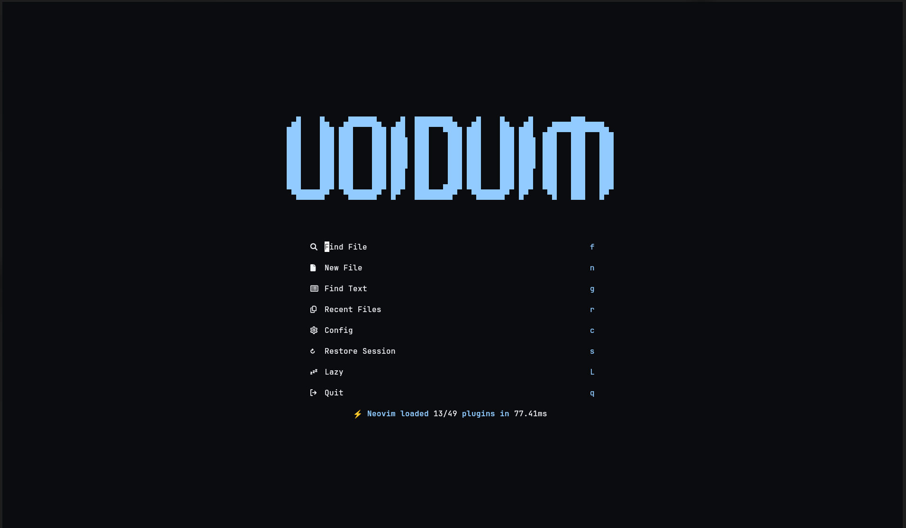
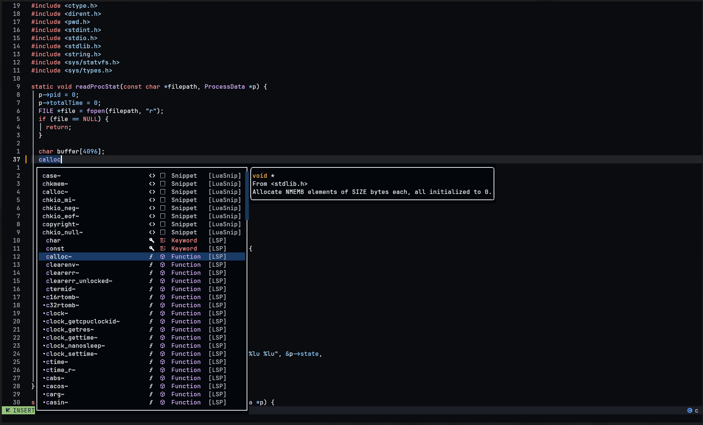
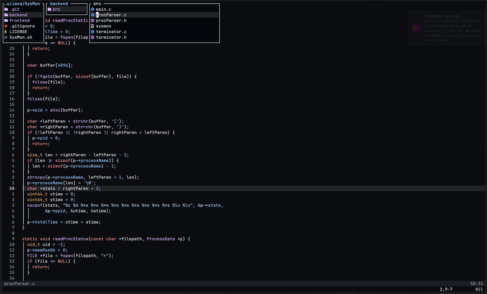

----------------------------------------------------------------------------------------

<div style="text-align: center;">
<pre>
 ▄█    █▄   ▄██████▄   ▄█  ████████▄   ▄█    █▄   ▄█    ▄▄▄▄███▄▄▄▄   
███    ███ ███    ███ ███  ███   ▀███ ███    ███ ███  ▄██▀▀▀███▀▀▀██▄ 
███    ███ ███    ███ ███▌ ███    ███ ███    ███ ███▌ ███   ███   ███ 
███    ███ ███    ███ ███▌ ███    ███ ███    ███ ███▌ ███   ███   ███ 
███    ███ ███    ███ ███▌ ███    ███ ███    ███ ███▌ ███   ███   ███ 
███    ███ ███    ███ ███  ███    ███ ███    ███ ███  ███   ███   ███ 
███    ███ ███    ███ ███  ███   ▄███ ███    ███ ███  ███   ███   ███ 
 ▀██████▀   ▀██████▀  █▀   ████████▀   ▀██████▀  █▀    ▀█   ███   █▀  
                                                                      
</pre>
</div>

---

---

My digital cockpit. Built for flow, speed, and zero friction.

## ∴ G A L L E R Y ∴

---





---

## ⏚ B O O T S T R A P ⏚

```bash
# Backup existing config
mv ~/.config/nvim ~/.config/nvim.bak

# Clone
git clone https://github.com/YOUR_USERNAME/YOUR_REPO_NAME.git ~/.config/nvim

# Launch
nvim
```

**Prerequisites:** `nvim 0.11+`, Nerd Font, `git`, `ripgrep`, `fzf`

---

Built around `snacks.nvim` and `mini.nvim` for a cohesive, lightweight experience.
